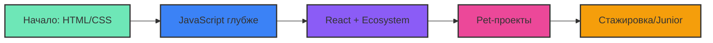

  
  
  <h1>
    
    Привет, я Иван
  </h1>
  
  <h3>18 y.o. web-разработчик на старте | Из вайбкода — в настоящий код</h3>
  
  
  
  
    
  
  

---

## 🧑‍💻 Обо мне

Мне **18 лет**, и я делаю осознанный шаг в профессиональную разработку.   
Раньше я пользовался «вайбкодом» и генерацией без понимания, но теперь выбрал другой путь:

> 🚫 **ИИ не пишет за меня код** — он объясняет, подсказывает и помогает учиться

Моя цель — стать настоящим **React-разработчиком**, понимающим каждый символ в своём коде. Я прохожу путь с нуля, и этот профиль — дневник моего роста.

---

## 🧭 Мой путь прямо сейчас

---

## 🛠️ Чему учусь сейчас

**Сейчас в фокусе:**  
📘 Углублённый JavaScript (ES6+, асинхронность)  
🎣 Основы React (компоненты, хуки, состояние)  
🧩 Сборка простых UI-блоков с нуля

---

## 🤖 Как я использую ИИ

| Раньше (вайбкод) | Теперь (ассистент) |
|-----------------|--------------------|
| Копировать готовое решение | Попросить объяснить концепцию |
| Не разбираться в ошибках | Попросить ИИ объяснить ошибку и исправить самому |
| «Сделай мне форму на React» | «Объясни, как поднять состояние формы, и напишу сам» |
| Не читать документацию | Сравнить ответ ИИ с докой |

**Мои правила:**  
✅ ИИ — это учебник и наставник, а не клавиатура  
✅ Каждая строчка кода проходит через моё понимание  
✅ Если не могу объяснить код ИИ — переписываю сам

---

## 📈 Моя активность (скоро изменится)

> *Эти графики пока пусты, но совсем скоро здесь будет зелено!*

---

## 🎯 Ближайшие цели

- [ ] Ежедневно коммитить хотя бы 1 час учёбы
- [ ] Закрыть 10 заданий на понимание JS
- [ ] Сверстать свой первый независимый компонент на React
- [ ] Написать пост о переходе от вайбкода к осознанности
- [ ] Сделать fork и внести свой PR в open-source (для опыта)

---

## ✨ Девиз 2026

> **«Не генерируй — понимай. Не копируй — создавай.»**

---

  
  
  <i>Спасибо, что заглянул. На связи — иду в веб-разработку осознанно.</i>

